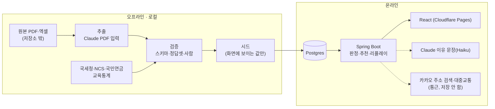

# 아키텍처

## 두 갈래
| 갈래 | 어디서 | 하는 일 | 원칙 |
|---|---|---|---|
| 오프라인 파이프라인 | 로컬 PC (이 저장소 `pipeline/`) | 운영계획서·수기 추출(Claude), 전공 매핑, 국세청·NCS·국민연금·교육통계 적재 | 결과를 검수해 **시드**로 확정. 실행 중 서비스는 이 API들을 부르지 않는다 |
| 온라인 서비스 | Render + Cloudflare Pages | 자격 판정(규칙), 추천(규칙 + 키워드, ADR-0018 — 근거 인용은 관심과 겹치는 원문, ADR-0020, 선호 전공·관심 어느 쪽도 안 맞으면 추천하지 않음, ADR-0022), 설명(Haiku), 모집기간 리플레이(관심 = 내 지망에 담은 사람, 가상 값 + 실제 담은 수 — ADR-0019), 직무 조회수, 통근 조회 | 시드는 읽기만 하고, 실행 중에 쓰는 건 계정·프로필·담은 지망·조회 기록뿐이다. 실행 중 외부 호출은 Claude 설명·카카오(통근 — 주소 검색과 대중교통) 2개뿐이고, 실패해도 캐시·템플릿·'불러오지 못했어요'로 화면이 깨지지 않는다. 카카오 결과(좌표 포함)는 저장하지 않는다(ADR-0007) |

## MVP 화면 (학생 흐름 + 센터 현황판)
진입: 시작 `/`([예시 프로필로 시작]·[센터 담당자로 보기]는 가입 없는 체험 계정) · 로그인·가입 `/login` · 내 정보 `/me`(프로필 삭제·탈퇴) — ADR-0008
1. 프로필 입력 `/profile`(사는 곳은 시·군·구 선택, [저장]+동의 때만 저장) → 2. 자격 판정 3층(학교 규정 → 지원 불가 / 기관 조건 → 확인 필요, 필수 자격증이 없으면 지원 불가 — ADR-0021 / 선호 전공 → 참고 표시, 모두 이유와 함께) → 3. 적합도 추천 + 근거 인용(2·3은 `/jobs` 한 화면) → 4. 직무 상세 `/jobs/:id`(AI 추출값 ↔ 근거 쪽·인용문, 사는 곳 기준 통근시간 — 카카오 실시간, 사는 곳이 없으면 서경대 기준) → 5. 1~3지망 점검 `/plan`(지망별 관심(다른 학생이 담은 수) + 빈 자리 제안, 모집기간 리플레이, 가상 신호 표시. 몰림 표시·경고는 하지 않음 — ADR-0015)
6. 센터 현황판 `/center`(읽기 전용 1화면, P0, CENTER 권한): 직무별 신호 대비 정원, 구조적 위험 요인, 문서 검토 알림, 지난 학기 0명 이력
P1(여유가 되면 순서대로): 지원 준비 `/plan/apply`(제출물·마감 체크리스트) → 상담 준비 `/plan/counsel`(진로취업상담에 가져갈 지망 요약) → NCS 직무 풀이(직무 상세 안). 지원 준비·상담 준비는 새 API 없이 만든다. 자기소개서 생성과 신청서 대신 작성·제출은 하지 않는다.

## 저장소·배포
- `skuniv-team11/Backend`(이 저장소): Spring Boot + pipeline + docs. Render Docker, Singapore, `main` 브랜치만 자동 배포, `/actuator/health`
- `skuniv-team11/Frontend`: React. Cloudflare Pages(https://fieldrun.pages.dev), `VITE_API_BASE_URL`로 이 백엔드를 부름. API 계약은 이 저장소 `docs/api/`
- DB: Render 무료 Postgres(10/2 생성 → 10/15~10/31에 다시 만들어 만료를 발표 뒤로, ADR-0005). 로컬에서 서버를 띄우지 않고 프론트·백엔드 모두 배포 주소로 테스트한다(10/2)
