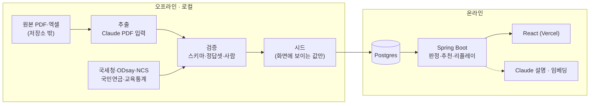

# 아키텍처

## 두 갈래
| 갈래 | 어디서 | 하는 일 | 원칙 |
|---|---|---|---|
| 오프라인 파이프라인 | 로컬 PC (이 저장소 `pipeline/`) | 운영계획서·수기 추출(Claude), 전공 매핑, 국세청·ODsay·NCS·국민연금·교육통계 적재 | 결과를 검수해 **시드**로 확정. 실행 중 서비스는 이 API들을 부르지 않는다 |
| 온라인 서비스 | Render + Vercel | 자격 판정(규칙), 추천(임베딩 + 가중치), 설명(Haiku), 모집기간 리플레이 | 시드만 읽는다. 실행 중 외부 호출은 Claude 설명·임베딩 2개뿐이고, 실패해도 캐시·템플릿으로 화면이 깨지지 않는다 |

## MVP 화면 (학생 중심)
1. 프로필 입력(예시 프로필 불러오기) → 2. 자격 판정(가능/조건부/불가 + 이유) → 3. 적합도 추천 + 근거 인용 → 4. 직무 상세(AI 추출값 ↔ 근거 쪽·인용문, 서경대 기준 통근시간) → 5. 1~3지망 조합 제안(모집기간 리플레이, 가상 신호 표시)
P1: 센터 현황판(읽기 전용) → 체크리스트 → NCS 직무 풀이

## 저장소·배포
- `skuniv-team11/Backend`(이 저장소): Spring Boot + pipeline + docs. Render Docker, Singapore, `release` 브랜치만 자동 배포, `/actuator/health`
- `skuniv-team11/Frontend`: React. Vercel, `VITE_API_BASE_URL`로 이 백엔드를 부름. API 계약은 이 저장소 `docs/api/`
- DB: Render 무료 Postgres(10/15 이후 생성, 11/14 만료) / 로컬 `docker-compose.yml`
